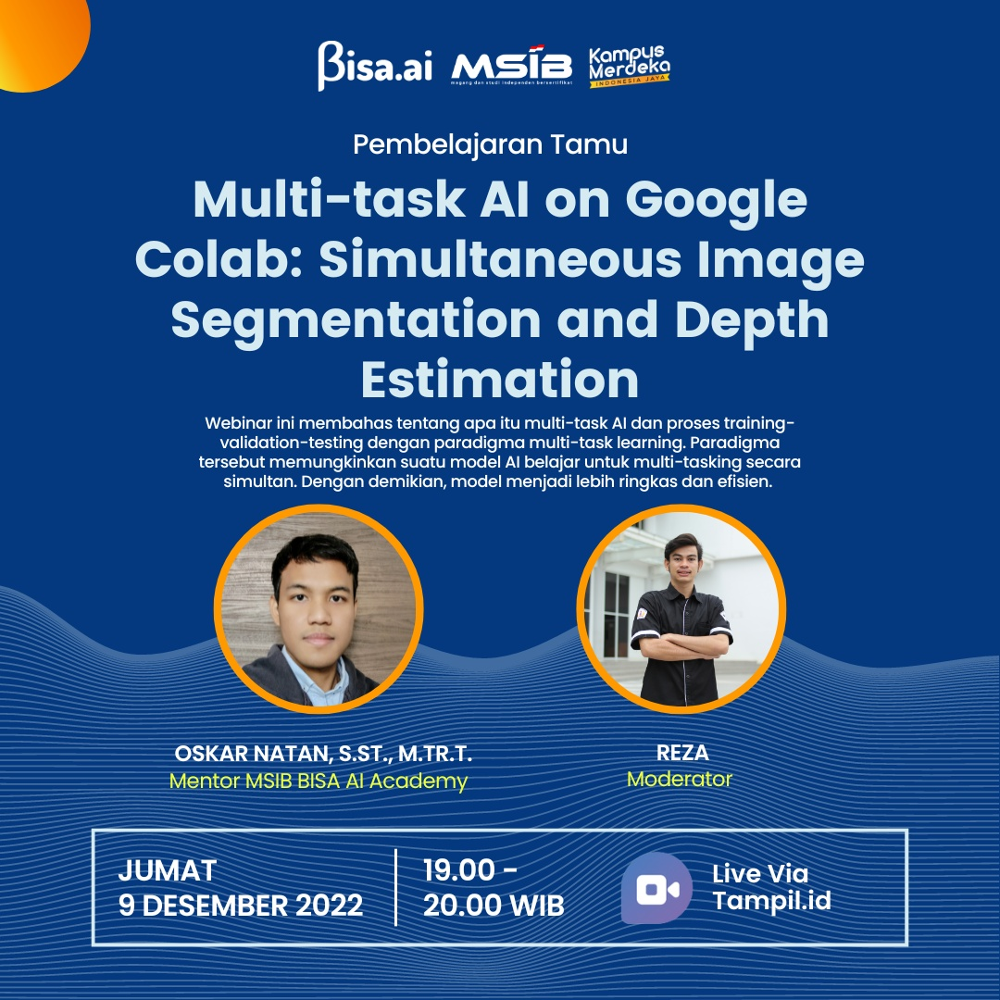

# Multi-task AI on Google Colab: Simultaneous Image Segmentation and Depth Estimation

## Implementasi program untuk [webinar BISA AI - Kampus Merdeka](https://tampil.id/event/detail/VFhwUmVrNTNQVDA9):

## Run di Google Colab:
1. Login akun google masing-masing
2. Run google colab [ini](https://colab.research.google.com/github/oskarnatan/mtl-bisaai/blob/main/mtl_seg_dep_colab.ipynb) atau [ini](https://colab.research.google.com/drive/1TxwaD-j6CTteFRLXfUnSNazqrY2g2qhT?authuser=2)
    - Ganti VM resource ke GPU untuk pemrosesan yang lebih cepat
    - Ganti variable 'rootdir' sesuai dengan direktori project di google drive anda masing-masing

## Run di Local PC:
1. Download dan extract dataset [cityscapes](https://www.cityscapes-dataset.com/) 
    - leftImg8bit_trainvaltest.zip (11GB)
    - gtFine_trainvaltest.zip (241MB)
    - disparity_trainvaltest.zip (3.5GB)
2. Run jupyter notebook dan buka mtl_seg_dep_local.ipynb
3. Jalankan program sesuai instruksi yang tertulis di notebook
    - Ganti variable 'rootdir' sesuai dengan direktori project di local PC anda masing-masing
4. Trained model untuk inference dapat didownload [di sini](https://drive.google.com/drive/folders/1Jft1n9vXaNHllUg5JDKDCYX9BJTYza0D?usp=sharing)

